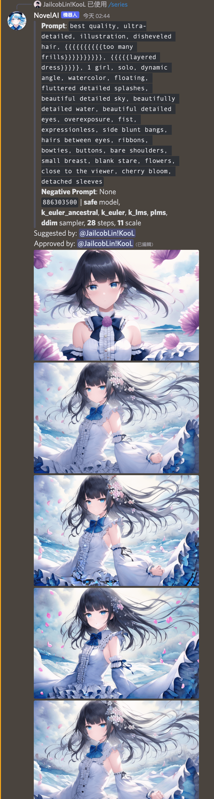
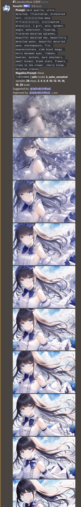
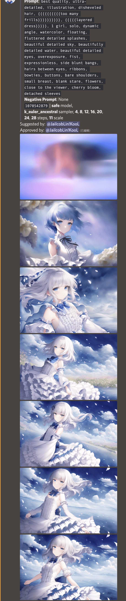

# NovelAI Discord Bot

A NovelAI bot with prompt suggestions supprt for friends.

> This is not an official NovelAI bot. This is a bot made by community member for community members.

> 

## Features

The bot will smartly queue up your requests and will not spam the API.

> Notice: After you authorize the bot, the bot will generate images in `Normal` size on your behavior only when you **use a command** or **approve a prompt**, which means **it will consume your Anlas** if you are not in Opus subscription.

### If You are a Subscriber

- [x] Auth the bot with your NovelAI account (Store token in the bot)
- [x] Generate images from command
- [x] Approve other's prompt suggestions

### If You are not a Subscriber

- [x] Suggest prompts, wait for approval

## Commands

`/auth <email> <password>`: Authenticate the bot with your NovelAI account.

`/revoke`: Revoke the previous authentication token.

`/generate <prompt> [negative] [shape] [smapler] [model]`: Generate an image from the prompt.

`/random [shape] [smapler] [model]`: Generate a random image.

`/series <prompt> <type> [negative] [shape] [smapler] [model]`: Generate a series of images from the prompt.

## Screenshots

> If you are not a subscriber, you can only suggest prompts and wait for approval.

> If you are a subscriber, you can directly generate images from the prompt.

### Series

`/series` command can be usefull to generate a series of images from the prompt by only changing one of the parameters.

| Samplers                                             | CFG Scales                                       | Steps                                          |
| ---------------------------------------------------- | ------------------------------------------------ | ---------------------------------------------- |
|  |  |  |

